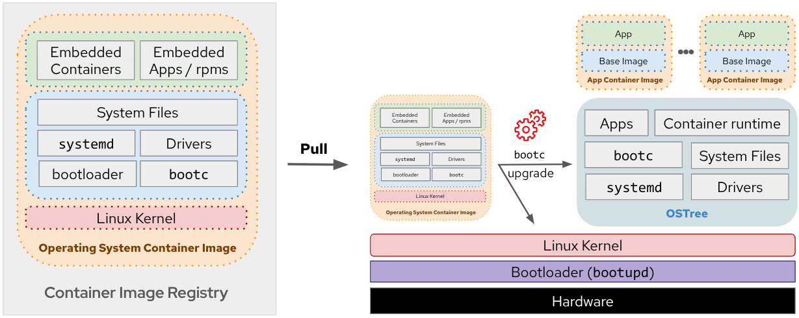

# Bootc Build Scenarios

A collection of examples demonstrating how to build bootc images across different environments and tools, including RHEL and non-RHEL systems OpenShift with Tekton and GitHub Actions. This repository serves as a practical guide for learning and comparing various workflows for bootc OS image creation.

## What is Bootc?

Bootc is a technology that enables transactional, in-place operating system updates using OCI/Docker container images by using bootable containers (container images that include the Kernel). It applies the successful container layering model to bootable host systems, using standard OCI/Docker containers as a transport and delivery format for base operating system updates.




## How do do you build Bootc images?

Building a bootc image follows a process similar to creating a traditional container image, with an additional extra steps if you need a installable OS asset.

1. Prepare the Containerfile that describe your image and the associated files
2. Build the Container image using standard tools
3. Create installable artifacts (optional). If you want to deploy on fresh hardware or a cloud instance (e.g., bare metal, VM, or cloud provider image), use `bootc-image-builder` to produce installable formats (ISO,RAW,VMDK,AMI,...)

## Repository Structure

This repository contains various scenarios and examples organized by platform and build methodology:

```
bootc-build-scenarios/
├── build/                # Build scenarios
├── doc/                  # Documentation files
├── images/               # Sample image definitions
└── tools/
    └── extract-oci-diskimage/  # Utility to extract disk images from OCI artifacts
```

## Scenarios Covered

These are the scenarios that you can find in this repo:

1. [Build using RHEL systems](build/rhel/)
2. [Build using Non-RHEL systems](build/non-rhel/)
3. [Build using GitHub Actions](build/github-actions/)
4. [Build using OpenShift Pipelines](build/openshift/)

## Quick Start

1. Clone this repository:
```bash
git clone https://github.com/luisarizmendi/bootc-build-scenarios.git
cd bootc-build-scenarios
```

2. Choose a scenario that matches your environment and requirements

3. Follow the README in the specific scenario directory


## Caveats

* Cross-architecture builds
Just like with regular container images, you can build for a different CPU architecture (e.g., creating an ARM64 image on an x86_64 system) using multi-architecture build tools.
However, this only works reliably for RAW images at the moment, other formats may fail when cross-compiled.

* Match your build environment to your target image type
For faster builds and fewer compatibility issues, use a build system that matches your target architecture and intended deployment platform.