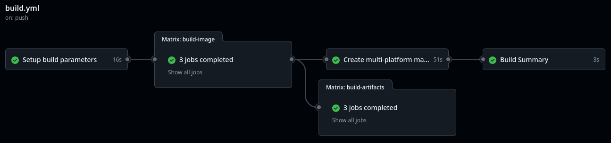

# Build bootc Image with GitHub Actions

This directory contains a GitHub Actions workflow (`.github/workflows/build.yml`) that builds a **bootc image** for multiple platforms and exports it in various formats.

The image is pushed to the **GitHub Container Registry (GHCR)**.


---

## How the Workflow Works




1. **Setup**
   - Reads input parameters or defaults.
   - Generates a build matrix for different platforms and formats.
2. **Build**
   - Uses `bootc` to build the image (x86 and ARM).
   - Creates a multi-arch container image manifest with both architectures
3. **Push**
   - Pushes the resulting container images to the **GitHub Container Registry**.

**⚠️ Note:** This workflow only builds the image, do not create the installable artifacts with `bootc-image-builder` because in order to do that you will need to create a custom runner (with x86 and ARM RHEL) and I wanted to keep this simple. You might create the installable artifacts based on the generated image by this GitHub actions workflow by using the method mentioned in the RHEL and Non-RHEL scenarions.


---

## Repository Setup

### 1. Place the Workflow File
The workflow file must be located at:

```
.github/workflows/build.yml
```

If it's placed elsewhere, GitHub Actions will **not** detect it.


### 2. Enable Required Workflow Permissions

To allow the workflow to read repository contents and push packages:

1. Go to **Repository Settings** → **Actions** → **General**.
2. Scroll to **Workflow permissions**.
3. Select:
   - ✅ **Read repository contents and packages permissions**
4. Click **Save**.


### 3. (Optional) Create a Personal Access Token (PAT)

The workflow does not need a PAT, but you will need it if you want to push anything into the **GitHub Container Registry (GHCR)**, for example in a further step you would like to push a container image with the installable artifact generated by `bootc-image-builder` embeded on it (more on why embedding artifacts in OCI registries in the [OpenShift scenario](../openshift/))

If that's your case, follow the steps below.

#### Steps:
1. Go to [GitHub Personal Access Tokens](https://github.com/settings/tokens).
2. Click **Generate new token** → **Classic**.
3. Add a note (e.g., *"GHCR push token"*).
4. Set expiration (optional but recommended).
5. Under **Scopes**, select:
   - `write:packages`
   - `read:packages`
   - `repo` (if the repository is private)
6. Click **Generate token**.
7. Copy the token (you won’t see it again).

**⚠️ Note:** Use your GitHub username as **GitHub Container Registry (GHCR)** username and the PAT as password to login 

---

## Usage

In order to trigger the workflow just push the Containerfile and the associated files into the root directory of the repository where you created the `.github/workflows/build.yml` file.

You will find the generated container images by reviewing the repository "Packages".
