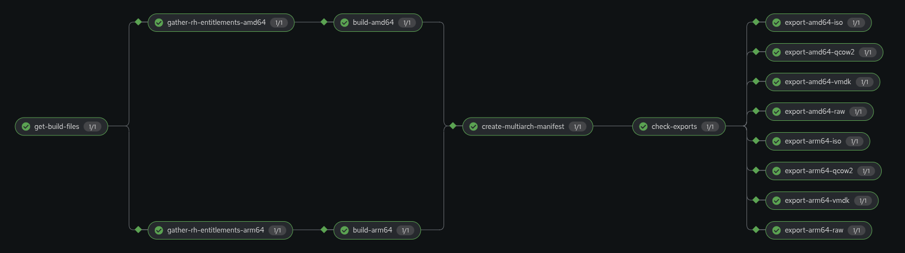

# Build bootc Image with OpenShift Pipelines

This directory contains the manifests to configure an OpenShift Pipeline that builds bootc images and their associated installable artifacts. This automated pipeline provides a complete CI/CD solution for creating containerized operating system images that can be deployed across different platforms and architectures.

---

## How the Workflow Works




The pipeline executes the following workflow steps in sequence:

1. **Obtains the Red Hat Entitlements** to be able to install packages in the bootc images. This step ensures that the build process has access to Red Hat's subscription-based repositories and entitled content, which is essential for building enterprise-grade bootc images.
   
2. **Build the x86 and/or ARM images** in parallel tasks, supporting multi-architecture deployments. This parallel execution significantly reduces build time while ensuring compatibility across different hardware platforms.
   
3. **Generates the multi-arch image manifest** that allows a single image reference to automatically select the appropriate architecture variant when pulled by different systems.
   
4. **Pushes images into the registry** with proper tagging and metadata, making them available for deployment and distribution.
   
5. **(Optional) Generate installable artifacts** such as ISO files, disk images, or other deployment formats, embed them into a container image and push it into an OCI registry for easy distribution and management.

**⚠️ Note:** This pipeline embeds the installable artifacts into a dedicated container image. This is a good idea if you want to minimize the external infrastructure needed, since you can use the OCI registry to host both the bootc image and the installable artifacts. A different option is to upload the artifacts into a storage system, for example an object storage. You can review [a variant of this pipeline that uses OpenShift Data Foundation object storage instead](https://github.com/luisarizmendi/workshop-moving-ai-to-the-edge/blob/main/deployment/openshift/bootstrap-lab/manifests/pipelines/05-admin-pipelines.yaml).


Once completed, you will have the generated images and artifacts in your container image registry in dedicated repositories:


---

## Environment Setup

### 1. Install OpenShift Pipelines Operator

This step installs the Tekton-based pipeline engine that powers the build automation:

* Go to **Operators > OperatorHub** in the OpenShift Console
* Search for **OpenShift Pipelines**
* Install the operator with the default settings
* Wait until the Operator is installed (this typically takes 2-3 minutes and creates the necessary pipeline infrastructure)

### 2. Create Project for Pipeline Resources

Create a dedicated project where the pipelines will be created. In the provided YAML it is `tools-rhel-image`. 

### 3. (Optional) RWX Storage NFS Provider

The pipeline runs parallel tasks, and some of them require persistent volumes that need to be shared between concurrent build processes. That means that you will need **Read-Write-Many (RWX)** volumes to allow multiple pods to access the same storage simultaneously. 

If your cluster does not have a storage provider that is able to give that kind of storage, for demo/workshop purposes you can create an NFS server inside your cluster and associate it to a custom CSI (not supported for production use). In order to do that, create the objects that you find under the `nfs-storage` directory (you can use the `+` button on the top right of the OpenShift UI to import the YAML files).

### 4. (Optional) Enable Pipeline Triggering from Source Code Repository

If you want to trigger the build pipeline automatically any time that you push new content into a source code repository (where you store the Containerfile and associated files), you can create the objects that you find under the `triggers` directory.

Before creating the objects, remember to change in the **"TriggerBinding"** the "registry" value with the registry where you will push your bootc image. You might also want to modify the `TriggerTemplate` object that contains the actual PipelineRun that will be executed to, for example, include additional architectures or installable artifacts based on your specific requirements.

### 5. (Optional) OpenShift ARM nodes

If you plan to use multiple architecture builds, you have two options available:

* **Use x86 nodes only** and perform cross-architecture builds. This approach is slower and only works for the image build phase, not for the installable artifact generation.

* **Configure your OpenShift cluster** to support multi-arch nodes and include at least one node of each architecture for native builds.

If you can follow the second option, it's better as it provides faster builds and full feature support. You will need to follow these steps to add multi-arch nodes:

**Step 1)** If you installed your cluster without multi-arch support, you will need to enable it. You can do it by using the [`multi-arch/1-update-to-multiarch.yaml`](multi-arch/1-update-to-multiarch.yaml). It triggers a cluster update, so it will take time to complete and you will lose connectivity for some moments to the UI during the update process.

**⚠️ Note:** You can check the upgrade status in **Administration > Cluster Settings** to monitor the progress.

**Step 2)** Once your cluster supports multi-architecture nodes (after the upgrade if you started from a non-enabled cluster, it could take time...), you will need to add additional nodes with different architectures. The way to do it is dependent on your underlying platform where OpenShift is installed. As an example, you can find the file [`multi-arch/2-aws-add-machineset.yaml`](multi-arch/2-aws-add-machineset.yaml) that creates the machineset and one ARM node in OpenShift when deployed on AWS.

Before using this file, update it with the right AMI ID. Put the correct AMI in `"<REPLACE_WITH_ARM64_AMI_ID>"`. You can get the list with the following oc command:

```bash
oc get configmap/coreos-bootimages \
  -n openshift-machine-config-operator \
  -o jsonpath='{.data.stream}' | jq \
  -r '.architectures.<arch>.images.aws.regions."<region>".image'
```

For example for us-east-2:
```bash
oc get configmap/coreos-bootimages -n openshift-machine-config-operator \
  -o jsonpath='{.data.stream}' | jq \
  -r '.architectures.aarch64.images.aws.regions."us-east-2".image'
```

This will output something like: `ami-0b04071739ccf4af2`. If you are in us-east-2, you can use directly that ID.

### 6. Create the Kubernetes Objects

* **Modify** the [`bootc-build-pipeline.yaml`](bootc-build-pipeline.yaml) to include your StorageClass if it's other than the NFS created in a previous step (`nfs-csi`). Review the resource requirements and adjust them based on your cluster's capacity.

* **Create the objects** using the modified [`bootc-build-pipeline.yaml`](bootc-build-pipeline.yaml) file

This deployment creates the following objects in your cluster:


These include the pipeline definition, required persistent volume claims, service accounts with appropriate permissions, and all the task definitions needed for the build process.

**⚠️ Note:** `bootc-build-pipeline.yaml` has been tested with OpenShift 4.18 and later versions.

### 7. Create the Required Image Pull Secrets

Create the required `Image Pull` secrets under your project (`tools-rhel-image` in this example) in **Workloads > Secrets** with the following values:

* **Secret `redhat-registry-secret`**: User and password credentials to login into the `registry.redhat.io` registry. This is required to pull Red Hat base images and access entitled content during the build process.

* **Secret `push-registry-secret`**: User and password credentials to login into the registry where you will push the bootc image (for example, quay.io/luisarizmendi). This enables the pipeline to push the final images to your target registry.

---

## Usage

### Triggering using the UI Wizard

**⚠️ Note:** Triggering with PipelineRuns (see it in the next section) is the preferred method since at this moment there is no way to include Affinity configuration when launching the Pipelines with the UI Wizard. This implies that if you have nodes with multiple architectures, the scheduling of the tasks cannot assure that, for example, the ARM build lands in an ARM node. This also means that if you are exporting installable artifacts, if the desired artifact architecture does not match the node's architecture, the pipeline will fail.

**Steps to trigger via UI:**

1. Go to **Pipelines** in the project that you created in the preparation steps

2. Click the **three vertical dots** on the right of your pipeline and click **"Start"**

3. Fill in the fields, including:

    * **GitHub repo** where the Containerfile and associated files describing the bootc image are located
    * **The subpath** on that repo where the Containerfile is located (if not in the root directory)
    * **The installable artifacts export formats** to be created (such as ISO, qcow2, raw disk images)
    * **The image architectures** to be built (x86_64, aarch64, or both)
    * **Workspaces configuration**:
        * Use the pre-created Persistent Volume Claims for the `shared-git-repo`, `rh-entitlements` and `shared-container-storage`
        * Use the secrets that you created: `redhat-registry-secret` and `push-registry-secret`
        * Keep the rest with the default EmptyDir configuration


4. **Start the Pipeline** and monitor its progress through the OpenShift Console


### Triggering using a PipelineRun object

You can also trigger the pipeline by creating a YAML object directly in the cluster, which provides more control over the execution parameters:

1. **Review the variable values** on the file [bootc-build-pipeline-run.yaml](./bootc-build-pipeline-run.yaml). Take a look at the same variables as the ones mentioned above in the UI wizard section, and customize them according to your build requirements.

2. **Create the object** in your project using `oc apply -f bootc-build-pipeline-run.yaml`

This method allows you to specify node affinity, resource limits, and other advanced configurations that are not available through the UI wizard.

### GitOps triggering

The last way to trigger the pipeline that we are going to cover is using GitOps automation for continuous integration.

If you prepared your environment with the triggering YAML files from the setup section, you just need to configure a webhook in your source code repository to automatically start builds on code changes.

The configuration will depend on your source code repository provider. In the case of GitHub, you need to do the following:

1. **Create a new repository** and place there the Containerfile and associated files in the root path (the trigger manifests are simple and do not look in other paths by default)

2. **Create a new Webhook** by selecting **"Add webhook"** under **Settings > Webhooks** in your GitHub repository. Include these values:

    * **Payload URL**: Search for the Webhook URL in the OpenShift UI under **Networking > Routes** in the project that you created. Paste that URL in the "Payload URL" box in the GitHub Webhook configuration page

    * **Content type**: `application/json`

Once you configure the Webhook, try to make a change in the Containerfile and push it to the repository. You should see how your pipeline is triggered automatically.

---

## Extracting the installable artifact from the container image

There are some specific tools that can extract files from container images, but you can also use standard container tooling for this task:

```bash
mkdir artifacts
podman create --name temp-container ghcr.io/{owner}/bootc-{directory}-{format}:{label}
podman cp temp-container:/ ./artifacts/
podman rm temp-container
podman rmi ghcr.io/{owner}/bootc-{directory}-{format}:{label}

# The installable files will be in ./artifacts/
ls -la artifacts/
```


I've also created a script that helps with that extraction process, [you can check it out here](../../tools/extract-oci-diskimage/). This script simplifies the process of getting your installable artifacts out of the container image format and onto your local filesystem for deployment.